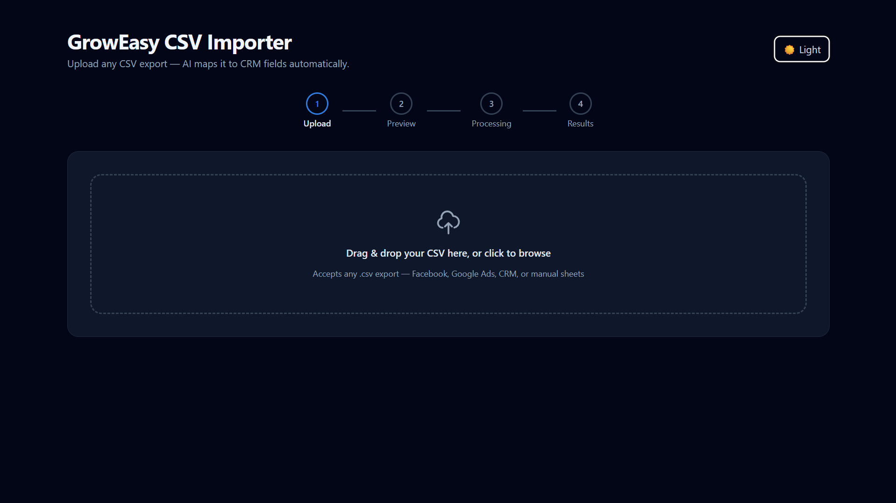
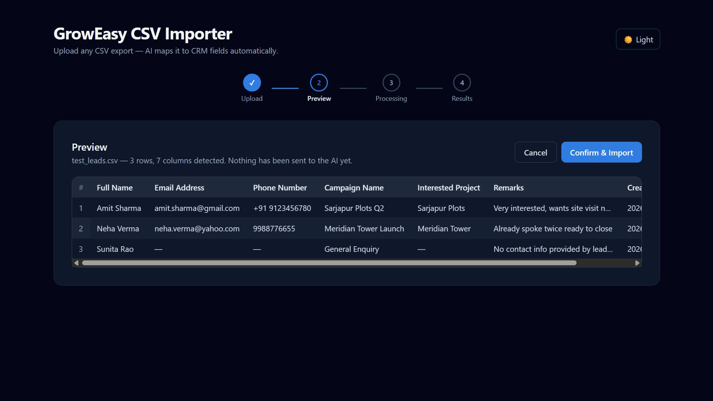
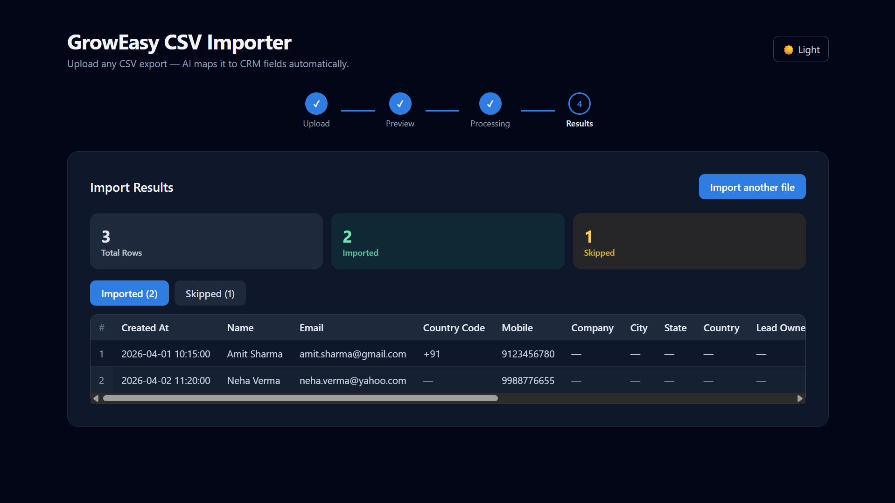
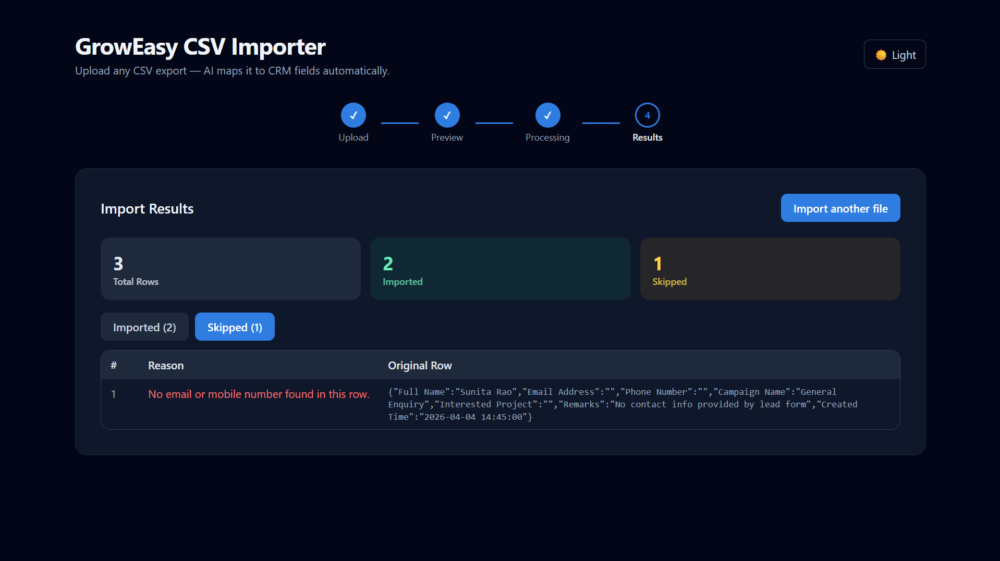

# CSV Importer

An AI-powered CSV importer that maps leads from *any* CSV layout (Facebook Lead Ads, Google Ads, real-estate CRMs, sales sheets, manual exports — anything) into a fixed CRM schema, using an LLM for the field-mapping step instead of hardcoded column rules.

## Screenshots

**1. Upload — drag & drop or browse for a CSV**


**2. Preview — parsed client-side, nothing sent to the AI yet**


**3. Results — imported records mapped to the CRM schema**


**4. Results — skipped records with the reason shown**


## How it works

1. **Upload** — user drags/drops or picks a `.csv` file.
2. **Preview** — the file is parsed *entirely client-side* (no AI call yet) and shown in a scrollable, sticky-header table so the user can sanity-check what they uploaded.
3. **Confirm & Import** — only on explicit confirmation does the frontend POST the file to the backend.
4. **AI Extraction** — the backend parses the CSV again server-side, batches rows (default 10/batch) to Groq (`llama-3.3-70b-versatile`) using structured JSON output, and maps arbitrary columns to the CRM schema.
5. **Results** — imported vs. skipped records are shown with totals. Rows without an email *and* a mobile number are skipped per spec.

## Limits

- **Max file size: 10MB** per upload (enforced by the backend's multer middleware; larger files are rejected with a clear error before parsing).
- **Max rows: 2,000** per CSV (enforced in `importController.ts`, to keep AI batch-processing time and Render's free-tier request timeout predictable for this demo). Larger files return a 413 error asking you to split the file.
- Both limits are easy to raise — see `backend/src/middleware/upload.ts` (file size) and `backend/src/controllers/importController.ts` (row cap) if you need higher ceilings for production use.

## Project structure

```
csv-importer/
├── backend/           # Node.js + Express + TypeScript API
│   └── src/
│       ├── controllers/   # request orchestration
│       ├── services/      # csvParser.ts, aiExtractor.ts (the core AI logic)
│       ├── middleware/     # multer upload, error handler
│       ├── routes/
│       └── types/
├── frontend/          # Next.js 14 (App Router) + TypeScript + Tailwind
│   ├── app/                # page.tsx = the 4-step flow
│   ├── components/         # FileUpload, CsvPreviewTable, ResultsTable, etc.
│   └── lib/                 # api client + shared types
├── samples/            # messy test CSVs (Facebook-style + fully generic headers)
├── screenshots/         # app screenshots used in this README
└── docker-compose.yml
```

## Running locally

### 1. Backend

```bash
cd backend
cp .env.example .env
# edit .env and set GROQ_API_KEY=gsk_...  (get a free key at https://console.groq.com/keys)
npm install
npm run dev       # starts on http://localhost:4000
```

### 2. Frontend

```bash
cd frontend
cp .env.local.example .env.local   # defaults already point to localhost:4000
npm install
npm run dev       # starts on http://localhost:3000
```

Open `http://localhost:3000`, upload one of the CSVs in `/samples`, and walk through the flow.

## Running with Docker

```bash
export GROQ_API_KEY=gsk_...
docker compose up --build
```

Frontend: `http://localhost:3000`, backend: `http://localhost:4000`.

## Design decisions worth knowing

- **AI provider: Groq (free tier, fast inference).** Uses `llama-3.3-70b-versatile` via Groq's OpenAI-compatible API. Groq's JSON mode (`response_format: json_object`) guarantees valid JSON but -- unlike OpenAI's `json_schema` strict mode -- doesn't enforce exact keys or enum values on its own, so `aiExtractor.ts` validates every field itself in `sanitizeRecord()`: missing keys are filled with `""`, and any `crm_status`/`data_source` value outside the allowed enum is dropped to `""` rather than trusted blindly.
- **Skip rule is deterministic, not AI-decided.** The AI maps fields; the backend (not the model) enforces "skip if no email and no mobile," since that's a hard business rule and shouldn't depend on model judgment.
- **Batching + retries.** Rows are sent in configurable batches (`AI_BATCH_SIZE`, default 10) with exponential-backoff retries (3 attempts) per batch, so one flaky batch doesn't fail the whole import.
- **Row order is preserved** via an `_idx` tag round-tripped through the model, with a positional fallback if the model ever returns a missing/invalid index, so results always map back to the correct original row.
- **Stateless by design.** No database — matches the spec's "optional" note and keeps the deployment surface small. Everything happens in a single request/response cycle.

## Bonus features implemented

- ✅ Drag & drop upload
- ✅ Loading/processing indicator during AI processing
- ✅ Retry mechanism (3 attempts, exponential backoff) per AI batch
- ✅ Dark mode toggle
- ✅ Docker setup (`docker-compose.yml` + Dockerfiles for both services)
- ✅ Sticky-header, scrollable, responsive tables for both preview and results
- ✅ Sample messy CSVs (`/samples`) to demonstrate ambiguous-column handling

## Things you could extend further

- Virtualized table rendering (e.g. `react-window`) for CSVs with tens of thousands of rows
- Streaming batch progress to the frontend via SSE/WebSocket instead of a single blocking request
- Unit tests for `csvParser.ts` and the skip-rule logic in `importController.ts`
- Swap `GROQ_MODEL` to another Groq-hosted model, or point `aiExtractor.ts` at OpenAI/Gemini/Claude instead -- it's isolated specifically so the provider can be swapped without touching the rest of the app